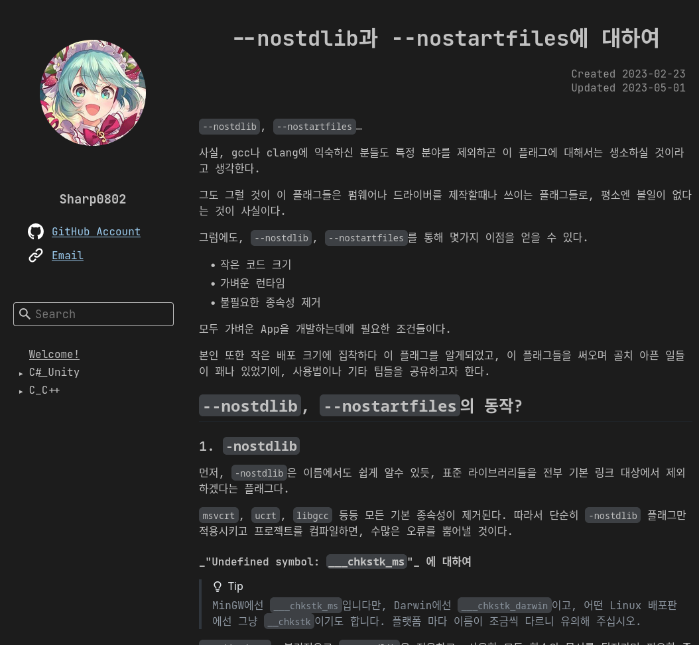

# SIKA

> **S**IKA **I**s a **K**nowledge **A**rchiver!

SIKA (formerly called as blogman) is a cross-platform static blog/note webpage generator, written in C#.

## GETTING STARTED

See [wiki](https://github.com/Sharp0802/blogman/wiki/Getting-Started).

## PREVIEW

- My [blog](https://sharp0802.github.io) generated with `sika`.
